# MEETUP-HUB

## Introduction
Meetup-Hub is a site for people around the world who is interested in programming. If you are an experienced programmer or just started doesn't matter, there is always more to learn from each other by sharing ideas and having a discussion. To be able to socialize and discuss programming with likeminded people is a potent way of learning fast, finding solutions quickly and having fun while doing it.

[View the live project here](https://bjornrodin.github.io/programmers-meetup-hub/)

## Table of Content
- [Introduction](#introduction)
- [User Experience (UX)](#user-experience-ux)
    - [User Stories](#user-stories)
        - [First Time Visitor Goals](#first-time-visitor-goals)
        - [Returning Visitor Goals](#returning-visitor-goals)
        - [Administrators](#administrators)
    - [Design](#design)
        - [Color Scheme](#color-scheme)
        - [Fonts](#fonts)
        - [Images](#images)
        - [Wireframes](#wireframes)
- [Features](#features)
    - [Existing Features](#existing-features)
        - [Navigation Bar](#navigation-bar)
        - [Header](#header)
        - [Home](#home)
        - [Programming](#programming)
        - [Gallery](#gallery)
        - [Sign Up](#sign-up)
        - [Thank You](#thank-you)
    - [Future Features](#future-features)
- [Technologies](#technologies)
- [Deployment](#deployment)
    - [Deployment Github Pages](#deployment-github-pages)
    - [Cloning Repository](#cloning-repository)
    - [Version Control](#version-control)
- [Credits](#credits)
    - [Media](#media)
    - [Code](#code)
- [Acknowledgements](#acknowledgements)

## User Experience (UX)

### Introduction

The goal of Meetup-Hub is to connect people across the globe who is interested in programming. By connecting people they can share ideas, discuss a project they are working on and find likeminded people who want to do the same. It should be easy for the user to sign up to the community and attend the meetups. By having a intuitive design the user will be able to navigate easily to find what they are looking for. The site is also made in such a way that the administrators can add more information and still keep the same look, which also should increase the users ability to navigate the site week after week even when updates are made.

### User Stories

#### First Time Visitor Goals
As a first time visitor I want to:
- know where I can find the community on social media.
- understand the main purpose of the site.
- learn more about programming.
- be able to sign up to the community.
- see pictures of earlier Meetups to know how they might have looked and been conducted.
- get feedback when submitting to the forms.

#### Returning Visitor Goals
As a returning visitor I want to:
- easily see planned Meetups.
- know what the Meetups will focus on.
- know at what time the Meetups will happen.
- easily attend the Meetups.
- learn more about programming.
- see pictures of earlier Meetups.

#### Administrators
As a administrator I want to:
- provide the user with a site that is easy to navigate.
- make it easy to find us on social media.
- aid in teaching about programming.
- make sign up forms as quickly as possible for the user to fill.
- provide the sense of a close community even if the meetups is on digital platforms.
- offer a clear view of what meetups that is planned and what the users can expect from them.

### Design

#### Color Scheme
The colors was extracted from the "meetup.jpg" image.
- #CDD2D5  was used as background color for the body of the site as well as some parts where it was needed as contrast.
- #364954  was used as background for navigation bar, footer and 'boxes' within the site.
- #E6CDB7  was used for hover-effects across the site.
- #99AEBB  was used as background for the HTML if the screensize is wider than 1920 pixels.

#### Fonts
The fonts that are used are from [Google Fonts](https://fonts.google.com/). The h1-h3 has 'Unbounded' as font while the body has 'Poppins', both have Sans-Serif as a fall back font.

#### Images
The images used are all taken from [Pexels](https://www.pexels.com/sv-se/) which is a site that provides images that are free to use.

#### Wireframes
To create the general idea of the site [Balsamiq](https://balsamiq.com/) was used to create the wireframes. The initial idea was to have the site designed like this, but when the coding started I realized that it would look much better the way I have done it now. As the site is for international use and we don't have an office location of sorts I also felt it would be redundant to include it on the pages.
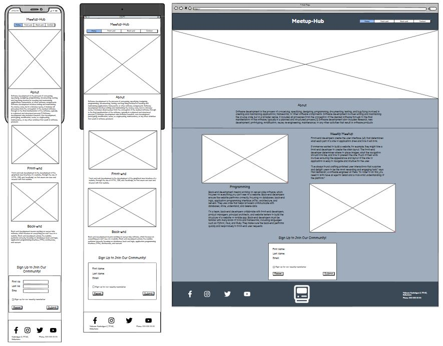

## Features

### Existing Features
#### Navigation Bar
- Featured on all four pages. The navigation bar is identical on all pages to make it easy to navigate the site and it includes the Logo, Home, Programming, Gallery and Sign up page. It is fully responsive and changes to a button with a dropdown-menu when the screen is smaller than 1000 pixels wide.
- This section allows the user to navigate easily while also having a indication of which page he is on via the underline of the active page. 
- It sticks to the top of the screen which mean the user doesn't have to use the 'back' button even if they are at the bottom of the page.
- Over 1000 pixels wide
    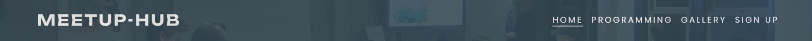
- Under 1000 pixels wide

    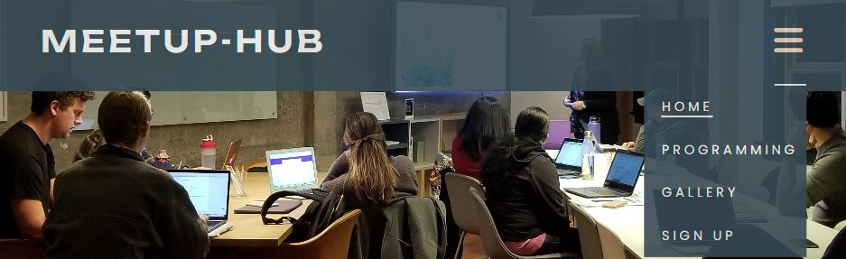

#### Header
- The header background changes depending on which page that is active to make it clearer for the user when you navigate to another page.
- All header backgrounds are styled the same to keep the structure and design intact.
- Home page
    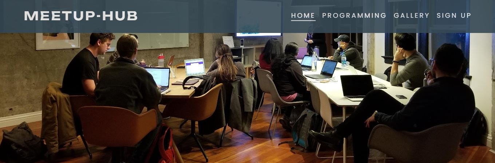
- Programming page
    
- Gallery page
    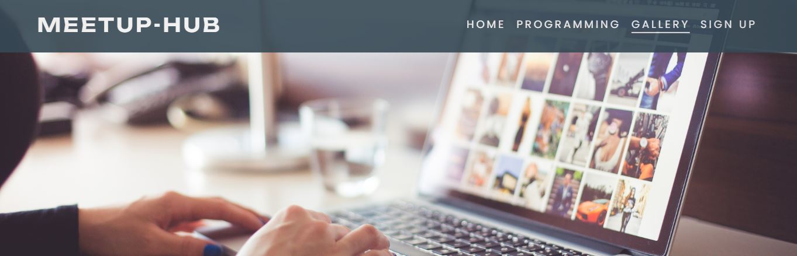
- Sign up page
    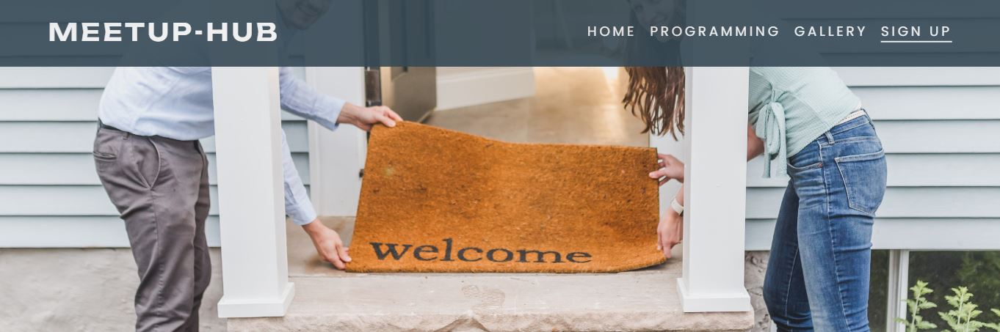

#### Home
- About
    - Used to explain in short what the site is supposed to be used for.
    - The user will see the value of what they can expect from the site and community.
    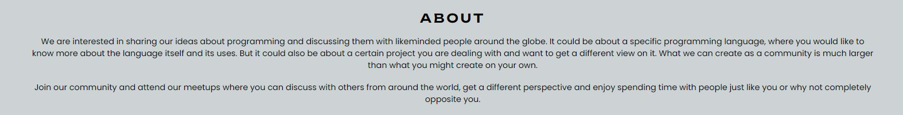
- What do we do?
    - Explaining how the Meetups is arranged and how the user can sign up for the meetings.
    - It is expected that users who is new to programming or interested in learning more want to find more information about programming, for that reason it is also explained that we have a section for that aswell.
    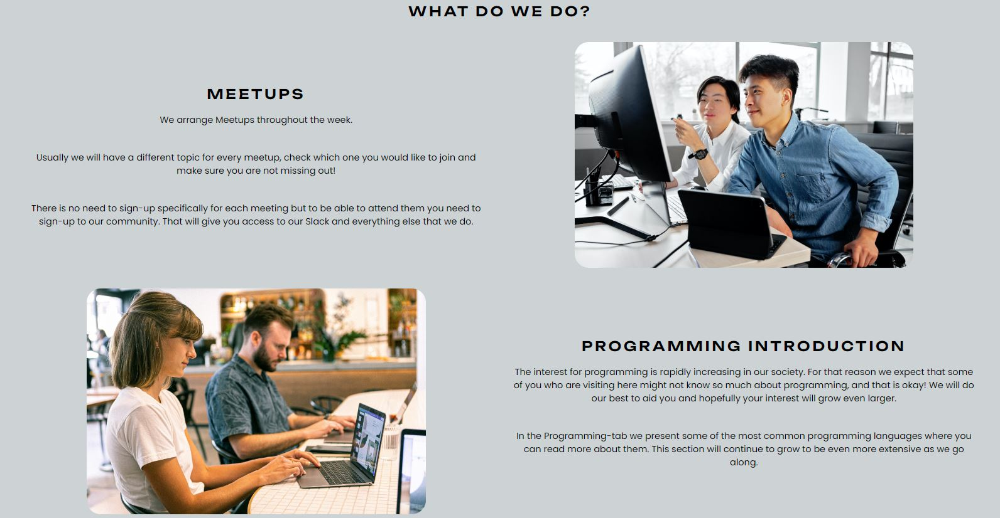
- Upcoming Meetups
    - All planned meetups is presented here and what each will focus on. 
    - Here a user can sign up for upcoming meetings with their Slack username to get their invitation link sent to their email.
    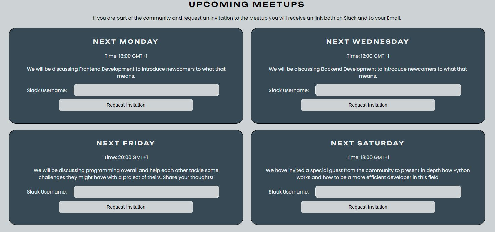
- Footer
    - Four social media links is provided, Facebook, Instagram, Twitter and Youtube where the user for example can find earlier recordings of meetups or follow the community more closely.
    - Link to Slack and where it can be downloaded to their platform.
    - All links open in a new window.
    - The footer is kept the same across the site.
    

#### Programming
- Introduction
    - Short introduction to the page and what the user will find further down.
    - The value for the user is that this page constantly will be updated so there is a reason to visit regularly.
    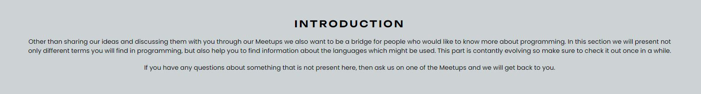
- What is Frontend and Backend?
    - Frontend and Backend development is explained in short to present to the users the fundamental differences between the two.
    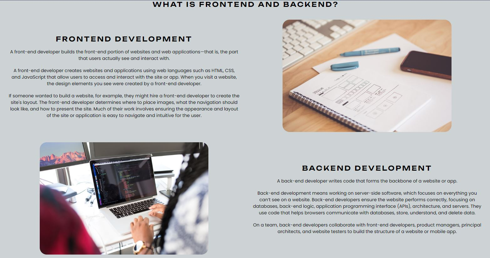
- Coding Languages
    - Some of the most used programminglanguages for Frontend and Backend is presented.
    - Each language has a short explanation for what it is or what it is used for.
    - All languages has a clickable name which sends the user to Wikipedia where they can read more about that specific language.
    - When clicked the link is opened in a new window.
    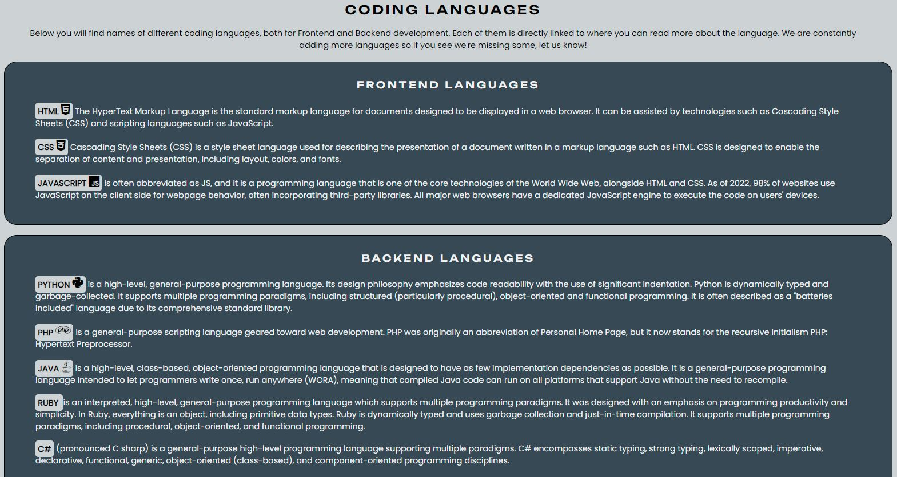

#### Gallery
- Gallery with pictures taken during past meetups by the community and/or sessions they've had when coding with friends and collegues.
- Used to make people feel excited to join and engage with the community.

#### Sign Up
- A form to sign up to the community to be able to attend meetups.
- Fields are required to make sure the form is filled out properly before submission.

    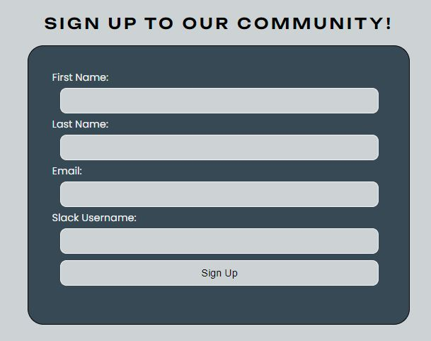

#### Thank You
- This page is presented to the user when signing up or requesting a invitation to one of the meetups.
- The message ensures the user that their submission has been processed correctly. 

    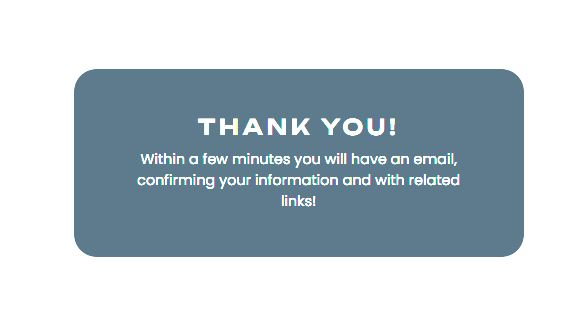

### Future Features
- Being able to login to the site.
    - When logged in the user for example wouldn't have to type their Slack username when requesting the invitation link for a Meetup, they would just have to click it.
- Upload pictures to the gallery.
- Social media feeds would be added to the site to have a preview of the most recent posts.
- The users could plan their own meetups and have them shown directly under the main ones.

## Testing

### User Stories Testing

#### As a first time visitor I want to understand the main purpose of the site.
- The home page of the website present the user with a clear hero-image that show a group of people meeting up. This was chosen to show the user a connection between the name of the page and the purpose.
- In the about section of the home page there is a clear message that we are a community that shares ideas and knowledge with eachother.
- Under the 'What do we do?' section it is explained what we are doing and what you can expect. Images that are shown here is connected to their respective part to engage the visitor. 
- In the 'Upcoming Meetups' the visitor will quickly see that there is meetups to sign up to, what they are regarding and at what times.
#### As a first time visitor I want to know where I can find the community on social media.
- In the footer, on each of the pages on the website, there is clear symbols of the different social media.
- When hovering over them it is indicated to the visitor that they are clickable.
#### As a first time visitor I want to learn more about programming.
- On the home page under 'Programming Introduction' it is mentioned that the user can go to the programming page.
- On the programming page the user can read more about programming in general.
- On the same page it is clear links to the different programming languages that are mentioned where the user can read more about them.
#### As a first time visitor I want to be able to sign up to the community.
- In the navigation bar, which is the same across the website, there is a 'Sign Up' page to the very right. 
- The form is very simple and clear for the user, when submitting they are presented with a 'Thank you' page to acknowledge the user that the submission went correctly.
#### As a first time visitor I want to see pictures of earlier Meetups to know how they might have looked and been conducted.
- In the navigation bar there is a 'Gallery' page.
- When going to the gallery the user is presented with pictures so they can see how the meetups has been done.
#### As a first time visitor I want to get feedback when submitting to the forms.
- When submitting information on the forms the user is presented with a 'Thank you' page to know the submission went correctly.
#### As a returning visitor I want to easily see planned Meetups, what they will focus on, what time they will occur and easily attend.
- On the home page a returning user can easily see planned meetups.
- They will also have all the information that is needed for signing up and know the times and what the focus will be.
- Each meetup also have a sign up so the user can easily sign up and then attend the meeting.
#### As a returning visitor I want to learn more about programming.
- The user can easily navigate to the 'Programming' page where they can find more information about programming.
- On the same page several programming languages is presented and the user can find links for each of them to read more about them.
- The user can attend meetups and listen to discussions other programmers have and learn by that.
#### As a returning visitor I want to see pictures of earlier Meetups.
- User can navigate to the 'Gallery' page and see the pictures.
- This page will continuously be updated with more pictures.
#### As a administrator I want to provide the user with a site that is easy to navigate.
- The header with the navigation bar has the same look on each page which makes navigation easy for the user.
- Overall the pages are designed the same way to not draw too much attention except for presenting the user with content.
#### As a administrator I want to make it easy to find us on social media.
- By having all the social media icons in the footer the users can easily find us on social media.
- The footer look the same on all pages.
- Icons in the footer are clickable and when users hover over them it is clearly shown that they can interract with those icons by clicking them.
#### As a administrator I want to aid in teaching about programming.
- We dedicate one entire page for programming.
- In the programming section we help users to find informationa about programming.
#### As a administrator I want to make sign up forms as quickly as possible for the user to fill.
- We have kept the forms as simple as we can by not making users have to fill huge amount of information.
#### As a administrator I want to provide the sense of a close community even if the meetups is on digital platforms.
- By having the gallery we can engage the users by showing them how they are done.
- In the pictures users can see clearly that we are meeting up in different ways across the globe.
- The social media and Slack is used to make people engage more in the community.
#### As a administrator I want to offer a clear view of what meetups that is planned and what the users can expect from them.
- On the home page there is a section specifically for upcoming meetups.
- The user can see what the focus will be, what day and time and they can also sign up by only entering their slack username in the form.

### Automated Testing
#### W3C Markup Validation Service

## Technologies
- [HTML](https://en.wikipedia.org/wiki/HTML) was used as the main language for the project.
- [CSS](https://en.wikipedia.org/wiki/CSS) was used to style the HTML elements.
- [Code Institute Template](https://github.com/Code-Institute-Org/gitpod-full-template) was used during this project.
- [GitHub](https://github.com/) is the host which is used to store the code.
- [Git](https://git-scm.com/) was used to commit and push the code to the GitHub repository and works as a version control software. 
- [Balsamiq](https://balsamiq.com/) was used to create the wireframes.
- [Fontawesome](https://fontawesome.com/) was used for the dropdown menu on smaller devices and for social media icons in the footer aswell as icons on the programming page.
- [Google Fonts](https://fonts.google.com/) was used to import the fonts that was used.
- [Google Chrome Developer Tools](https://developer.chrome.com/docs/devtools/overview/) was used during the whole project, especially while debugging and making it responsive for different screen-sizes.
- [W3C HTML Validator](https://validator.w3.org/) was used to check for errors in the HTML code in the end of the project.
- [W3C CSS Validator](https://jigsaw.w3.org/css-validator/) was used to check for errors in the CSS code in the end of the project.
- [Google Chrome Lighthouse](https://developers.google.com/web/tools/lighthouse) was used when testing the site.
- [W3C School](https://www.w3schools.com/) was used to aid in coding.
- [Pexels](https://www.pexels.com/sv-se/) was used to find images for the site.
- [Adobe Color](https://color.adobe.com/sv/create/image) was used to extract colors from the 'meetup.jpg' image.
- [My ColorSpace](https://mycolor.space/) Was used to find matching colors for those extracted in Adobe Color.
- [Contrast Grid](https://contrast-grid.eightshapes.com/) Was used to see how the different color would contrast against black and white texts.
- [Cloudconvert](https://cloudconvert.com/) was used to convert images to WEBP-format

## Deployment 

### Deployment Github Pages
1. Navigate to the [repository](https://github.com/BjornRodin/programmers-meetup-hub)
2. Click on 'Settings' (found in the top/middle of the page).
3. Click on 'Pages' in the menu on the left which will open 'GitHub Pages'.
4. From the dropdown menu 'Source' under the header 'Build and Deployment', select 'Deploy from a Branch'.
5. From the dropdown menu under 'Branch', select 'main' and the folder to the right to 'root'. 
6. Click Save.
7. The page should refresh and the deployment link should appear above 'Build and deployment'.

### Cloning Repository
1. Navigate to the [repository](https://github.com/BjornRodin/programmers-meetup-hub)
2. Click on the 'Code' button on top of the repository and copy the HTTPS link. 
3. Open Git Bash
4. Type 'git clone' and then paste or type the link.
5. Press Enter
The project is now cloned.

### Open Cloned Repository
1. After cloning, type 'ls' and hit 'enter' to locate your repository on your computer.
2. Locate the folder on your computer.
3. Open the folder and double-click the 'index' file to open.

### Version Control
- A repository was made on Github with Code Institutes Template.
- Coding for the site was done on the [Gitpod](https://www.gitpod.io/) platform.
- Code was added to the staging area with the 'git add .' command.
- The changes in the staging area was committed with the 'git commit -m " "' command.
- All committed code was pushed to Github repository with the 'git push' command.

## Credits
### Media
All pictures was downloaded from [Pexels](https://www.pexels.com/sv-se/). Thanks to all authors below for sharing your pictures:
- [Mikhail Nilov](https://www.pexels.com/sv-se/@mikhail-nilov/)
- [ThisIsEnginering](https://www.pexels.com/sv-se/@thisisengineering/)
- [Picjumbo](https://www.pexels.com/sv-se/@picjumbo-com-55570/)
- [fauxels](https://www.pexels.com/sv-se/@fauxels/)
- [Product School](https://www.pexels.com/sv-se/@product-school-1299359/)
- [Canva Studio](https://www.pexels.com/sv-se/@canvastudio/)
- [Djordje Petrovic](https://www.pexels.com/sv-se/@djordje-petrovic-590080/)
- [Christina Morillo](https://www.pexels.com/sv-se/@divinetechygirl/)
- [cottonbro studio](https://www.pexels.com/sv-se/@cottonbro/)
- [Markus Spiske](https://www.pexels.com/sv-se/@markusspiske/)
- [Tima Miroshnichenko](https://www.pexels.com/sv-se/@tima-miroshnichenko/)
- [Anna Shvets](https://www.pexels.com/sv-se/@shvetsa/)
- [Tirachard Kumtanom](https://www.pexels.com/sv-se/@tirachard-kumtanom-112571/)
- [Visual Tag Mx](https://www.pexels.com/sv-se/@visual-tag-mx-1321732/)
- [Fox](https://www.pexels.com/sv-se/@hillaryfox/)

### Code
- The code that was used in the project was mostly learnt via [Code Institute](https://codeinstitute.net/se/) and their Full Stack Software Development course.
- [Codepen](https://codepen.io/raneio/pen/NbbZEM) was used specifically to design the dropdown menu but was adapted to this site's need.
- [W3 School](https://www.w3schools.com/) was mostly used to solve issues or alternate ways to do the coding.

### Content
- Most of the content is taken from [Wikipedia](https://en.wikipedia.org/wiki/Main_Page) to have one main source.
- Some of the content is taken from [Coursera.org](https://www.coursera.org/), specifically about what Frontend and Backend development.
- The more general content like the "About" and "Introduction" sections was written by me.

## Acknowledgements
- Thank you to my family, especially Joakim Rödin, who have supported, pushed and encouraged me during the project.
- Gratitude to my mentor Jack Wachira for the support he has given me.
- The Slack community.